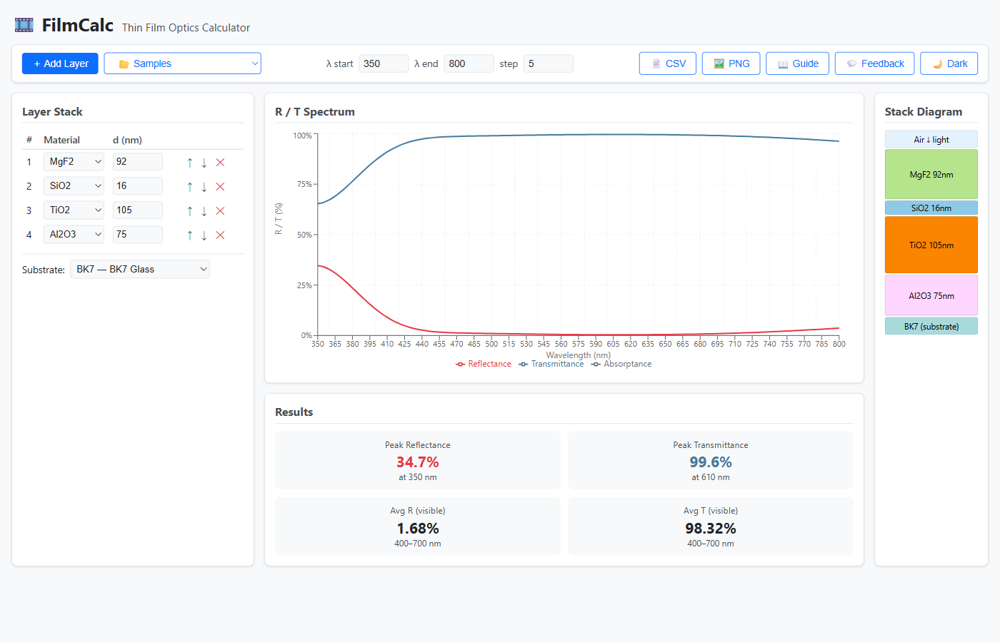

# FilmCalc

**Free, browser-based thin-film optical coating calculator.**

Replace expensive desktop tools (TFCalc, Essential Macleod) with a fast, open-source web app that computes reflectance and transmittance spectra using the Transfer Matrix Method.

 <!-- TODO: add screenshot -->

## Features

- **Layer Stack Editor** — define substrate + up to 10 layers (material, thickness in nm); add, remove, reorder
- **Built-in Material Library** — SiO₂, TiO₂, MgF₂, Si₃N₄, Al₂O₃, Ta₂O₅, Al, Ag, Au, Cu, BK7, fused silica, Si with wavelength-dependent n(λ)+ik(λ)
- **R/T Spectrum Chart** — interactive Recharts plot (300–1100 nm) with hover values and R/T/A toggle
- **Stack Diagram** — color-coded visualization of the film stack with thickness-proportional bars
- **Results Summary** — peak R/T, average visible-range values
- **Preset Designs** — quarter-wave AR coating, high-reflector stack
- **Export** — download spectrum as CSV, chart as PNG
- **Light / Dark Theme**

## Quick Start

```bash
# Prerequisites: Node ≥ 18, pnpm
pnpm install
pnpm build
pnpm dev          # opens http://localhost:1449
```

Run the engine tests:

```bash
pnpm test
```

## Key Equations

**Phase thickness** of layer _j_ at wavelength λ:

```
δⱼ = 2π nⱼ dⱼ / λ
```

**Transfer matrix** per layer:

```
Mⱼ = ┌ cos δⱼ        i sin δⱼ / ηⱼ ┐
     └ i ηⱼ sin δⱼ   cos δⱼ        ┘
```

where η = n at normal incidence.

**System matrix:**

```
M = M₁ × M₂ × … × Mₙ
```

**Fresnel reflection coefficient:**

```
r = (η₀ M₁₁ + η₀ ηs M₁₂ − M₂₁ − ηs M₂₂)
  / (η₀ M₁₁ + η₀ ηs M₁₂ + M₂₁ + ηs M₂₂)
```

**Reflectance / Transmittance:**

```
R = |r|²    T = (ηs / η₀) |t|²
```

**Quarter-wave condition:** d = λ / (4n) → minimum reflectance at design wavelength.

## Tech Stack

| Layer   | Technology                     |
| ------- | ------------------------------ |
| Engine  | TypeScript, Vitest             |
| Web UI  | React 19, Vite, Recharts       |
| Mono­repo | pnpm workspaces              |

## Project Structure

```
filmcalc/
├── packages/
│   ├── engine/          # @filmcalc/engine — transfer matrix, materials, spectrum
│   │   └── src/
│   │       ├── complex.ts      # complex-number arithmetic
│   │       ├── materials.ts    # n(λ)+ik(λ) database
│   │       ├── tmm.ts          # transfer matrix method
│   │       ├── spectrum.ts     # R/T spectrum computation
│   │       ├── designs.ts      # preset coating designs
│   │       ├── export.ts       # CSV / summary export
│   │       └── __tests__/      # Vitest unit tests
│   └── web/             # @filmcalc/web — React front-end
│       └── src/
│           └── components/
│               ├── LayerEditor.tsx
│               ├── SpectrumChart.tsx
│               ├── StackDiagram.tsx
│               ├── ResultsSummary.tsx
│               └── Toolbar.tsx
├── PLAN.md
├── package.json
└── pnpm-workspace.yaml
```

## License

MIT
